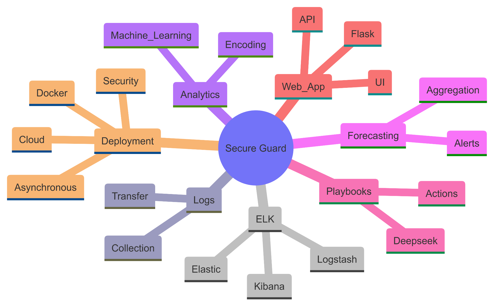

# 🛡️ Secure Guard: AI-Driven Incident Response System

## 📘 Overview

**Secure Guard** is a cutting-edge AI-powered system that transforms cybersecurity incident response by combining real-time data ingestion, machine learning-based prediction, time-series forecasting, and dynamic playbook generation. Built with scalability and automation in mind, this system provides Security Operations Centers (SOCs) with the tools necessary to detect, forecast, and respond to threats efficiently.

> 🔗 Referenced Notebooks:
> - [Forecasting Incident Trends](https://www.kaggle.com/code/seclayer/notebook8959a9327e)
> - [Incident Triage Prediction](https://www.kaggle.com/code/seclayer/tasos-incident-triage-prediction-microsoft/edit)
> - [Model Training and Evaluation](https://www.kaggle.com/code/seclayer/notebook062aadfcf1)
> - [Test 2](https://www.kaggle.com/code/seclayer/test-2)
> - [Test 3](https://www.kaggle.com/code/seclayer/test-3)

---

## 🔍 1. Problem Statement

In today's digital landscape, the rapid increase in cybersecurity threats makes manual threat detection ineffective. Traditional tools lack:
- Real-time detection capacity.
- Predictive analytics to forecast attacks.
- Adaptive responses for dynamic threat behavior.

Secure Guard addresses this by:
- Collecting logs from Windows machines in real-time.
- Ingesting data into a Dockerized ELK stack.
- Applying ML to classify and forecast incidents.
- Generating dynamic response playbooks using Deepseek.

---

## 🏗️ 2. System Architecture

Secure Guard's multi-pipeline architecture includes:

- **Log Collection Layer**: Filebeats and PowerShell scripts monitor Windows endpoints.
- **Ingestion & Processing**: Logstash parses logs, Elasticsearch indexes them, Kibana visualizes them.
- **ML Layer**: XGBoost predicts category, grade, and MITRE ATT&CK technique.
- **Forecasting Layer**: 24-hour forecast using time-series regression.
- **Response Engine**: Deepseek auto-generates remediation playbooks.
- **Web UI**: Flask dashboard visualizes all insights.

---

## 📥 3. Data Collection & Ingestion

Log data is collected via:

- **Filebeats**: Installed on Windows endpoints.
- **PowerShell Scripts**: Capture Windows-specific artifacts.
- Logs are transferred to a Docker-hosted **ELK Stack**.

Key ingestion visuals:

---

## 🧼 4. Data Preprocessing & Feature Engineering

### Steps:
- Remove duplicate or noisy logs.
- Extract structured features like `incident_grade`, `alert_title`, `category`.
- Apply **label encoding** on categorical data.
- Use PCA for dimensionality reduction.

Key steps diagrammed:

---

## 🤖 5. Machine Learning Model

The ML pipeline uses:
- **XGBoost** with GridSearchCV.
- Evaluation metrics: accuracy, precision, recall, F1-score.
- Input features include encoded categories and alert attributes.

### Training Overview:
- Dataset: Microsoft Incident Response (Kaggle)
- Labels: Grade, Category, MITRE Tactic
- Notebook: [Notebook 062aadfcf1](https://www.kaggle.com/code/seclayer/notebook062aadfcf1)

---

## ⏱️ 6. Forecasting Future Threats

Forecasts 24-hour incident volume using:
- Lag features.
- Rolling statistics.
- Time-of-day indicators.
- Model: Prophet + XGBoost

### Reference:
[Forecasting Notebook](https://www.kaggle.com/code/seclayer/notebook8959a9327e)

Forecast Output:

---

## 🧭 7. Deepseek-Powered Dynamic Playbooks

Secure Guard integrates **Deepseek** to:
- Generate step-by-step response actions.
- Tailor remediation for each incident type.
- Update playbooks dynamically.

Output Example:

---

## 🖥️ 8. Interactive Flask Dashboard

A Flask web app shows:
- Live log stream.
- Predicted incident attributes.
- Forecasts & alerts.
- Playbooks.

Technologies:
- Flask + Celery
- Redis for task queuing
- WebSockets for real-time UI

---

## 🧪 9. Validation Using Atomic Red Team

To ensure real-world relevance:
- Simulated attack scenarios using **Atomic Red Team**
- Logs generated from simulated malware, persistence, and lateral movement
- Verified response accuracy & playbook relevance

---

## 📈 10. Evaluation Metrics

### ML Model:
- Accuracy: ~85%
- F1-Score: ~85%

### Forecasting:
- RMSE, MAE computed from 30-day window

### Notebooks Referenced:
- [Test-2](https://www.kaggle.com/code/seclayer/test-2)
- [Test-3](https://www.kaggle.com/code/seclayer/test-3)

---

## 🧠 11. Innovations and Contributions

- Real-time log management with Dockerized ELK.
- Label encoding + PCA for high-dimensional incident features.
- 24hr forecasting shifts detection → prediction.
- Dynamic playbooks tailor guidance per incident context.

---

## 🔮 12. Future Enhancements

- Multi-platform support (Linux/Mac logs).
- GPT-based NLP triage assistants.
- Threat Intelligence integration (MISP, OTX).

---

## 🙌 Acknowledgments

- Microsoft Kaggle Dataset for incident logs.
- Deepseek team for open-source playbook guidance.
- Atomic Red Team for attack simulation.

---

## 🤝 Contact

Maintained by: **Muhammed Muiz Arummal**

> For inquiries or contributions, please open an issue or pull request on GitHub.

---

## 📚 Appendix A: Dataset Features Overview

The Microsoft Incident Response dataset includes over 40+ fields. Notable ones used:

| Feature | Description |
|---------|-------------|
| `incidentid` | Unique ID for each incident |
| `alertid` | Identifier for the alert |
| `category` | Type of threat (phishing, malware, etc.) |
| `incidentgrade` | Severity (Low, Medium, High) |
| `evidencerole` | Role in attack (source/target) |
| `accountname`, `ipaddress`, `devicename` | User and device metadata |
| `threatfamily` | Malware/ransomware family |
| `hour`, `countrycode`, `state` | Time & location attributes |

These are encoded using `LabelEncoder` before training.

---

## 📚 Appendix B: Key Equations

### XGBoost Loss Function

\[
Obj = \sum_{i=1}^{n} l(y_i, \hat{y}_i) + \sum_{k=1}^{K} \Omega(f_k)
\]

Where \( \Omega(f_k) = \gamma T + rac{1}{2} \lambda \sum w^2 \)

### Forecasting Error

\[
MSE = rac{1}{n} \sum_{t=1}^{n} (y_t - \hat{y}_t)^2
\]

---

## 🔧 Appendix C: Technologies Used

| Category | Tools |
|----------|-------|
| Log Collection | Filebeats, PowerShell |
| Processing | Logstash, Elasticsearch, Kibana |
| ML/Forecasting | XGBoost, Prophet, Scikit-Learn |
| Backend | Flask, Celery, Redis |
| UI/Real-Time | AJAX, WebSocket |
| Containerization | Docker, (Optional: Kubernetes) |
| Testing | Atomic Red Team, Jupyter |

---

## 🎓 Appendix D: Evaluation Setup

- **Windows Machines** for endpoint simulation
- **Cloud-hosted ELK** stack on Linux VM
- **Notebook-based model validation** on Kaggle:
  - Cross-validation
  - Confusion matrices
  - Forecast plots (Prophet components)

---

## 🧪 Example Attack Simulations (Atomic Red Team)

| Technique | Simulated Behavior |
|----------|---------------------|
| T1059 | Command-line shell execution |
| T1021 | Remote Desktop Protocol usage |
| T1086 | PowerShell malware execution |
| T1071 | Exfiltration via network |

---

## 🔄 Feedback Loop

SOC analysts can:
- Label prediction outcomes (correct/incorrect)
- Submit feedback on playbook steps
- Trigger retraining pipelines

---

## ✅ Summary

Secure Guard delivers:
- 📥 Robust ingestion
- 🤖 Accurate ML classification
- ⏱️ Reliable short-term forecasting
- 📜 Auto-generated, contextual playbooks
- 📊 Live visualization of incident lifecycle

